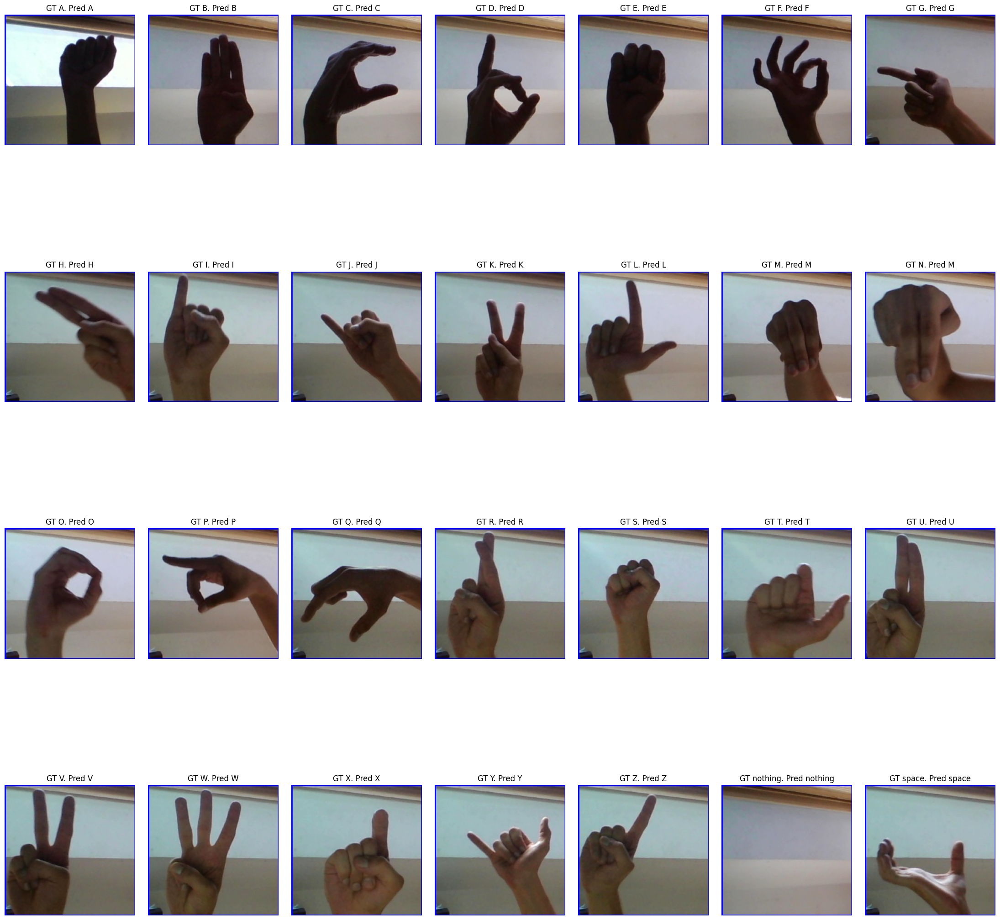
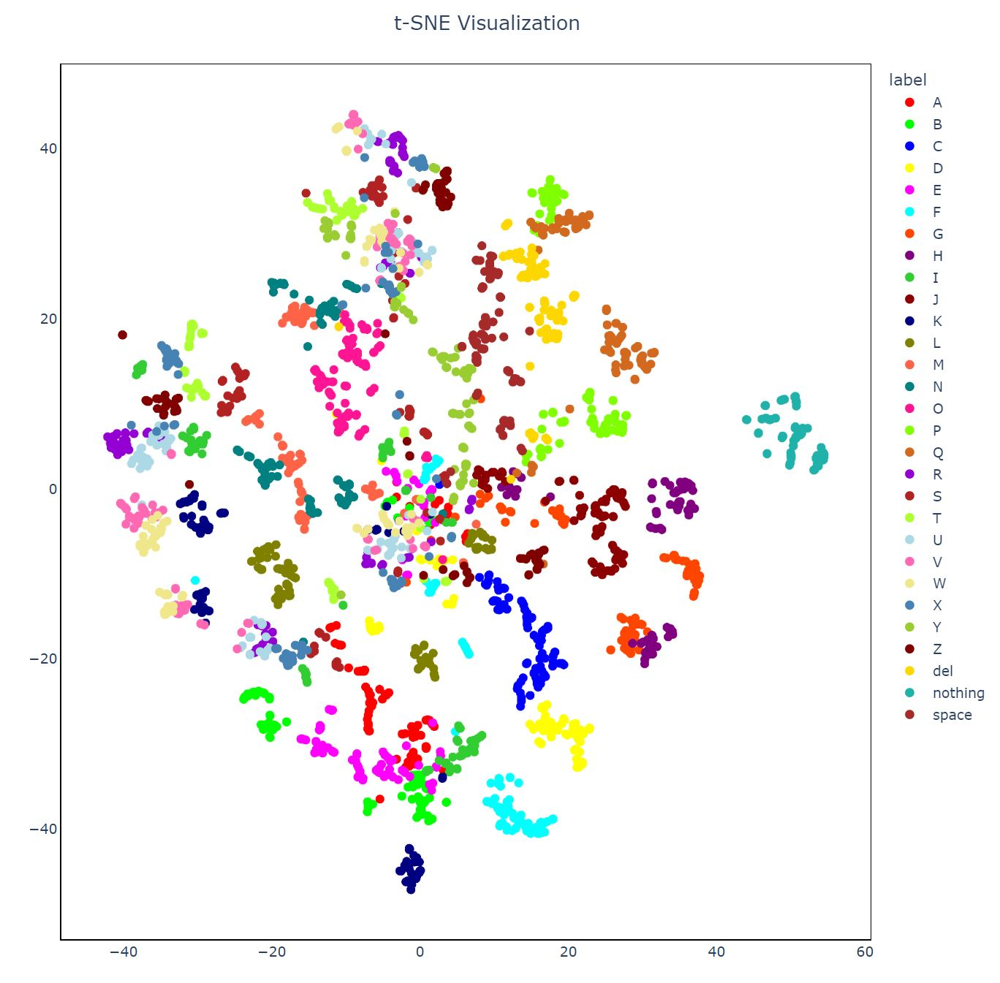
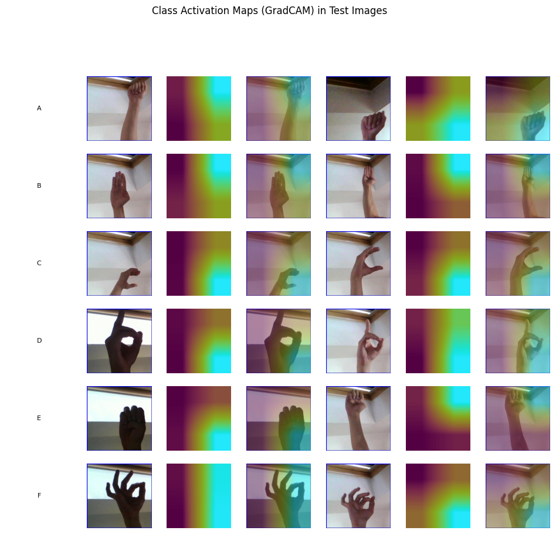

I made an implementation of YoloV8 with some custom dense layers.
Goals was:
1. To classify ASL symbols
2. To see some hidden layers features

Dataset:
https://www.kaggle.com/datasets/grassknoted/asl-alphabet

Model:
https://github.com/ultralytics/ultralytics

Reference:
Class Activation Maps (Grad-CAM)
https://pyimagesearch.com/2020/03/09/grad-cam-visualize-class-activation-maps-with-keras-tensorflow-and-deep-learning/

Predictions:

Visualisation(TSNE)

Class activation map:

